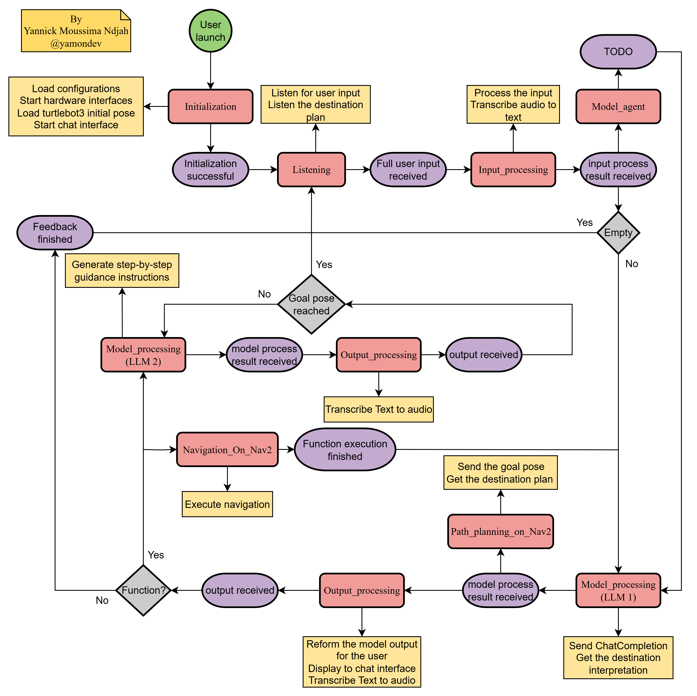

[](https://github.com/yamondev) &nbsp;
[](http://docs.ros.org/en/humble/index.html) &nbsp;
[](https://ubuntu.com/) &nbsp;
[](https://github.com/yamondev/indoor-voice-nav-llm/stargazers) &nbsp;
[](https://www.linkedin.com/in/yannickmoussima/) &nbsp;
# indoor-voice-nav-llm

##  Pipeline of the voice assistant 

## 🚀 Features

- 🤖 **ROS Integration**: Smoothly interacts with the Robot Operating System (ROS) for expansive robotic control. 

- 🧠 **Large Language Models Support**: Leverages GPT-4 and ChatGPT for enhanced decision-making and task management.

- 🗣️ **Natural Interaction**: Facilitates intuitive communication with robots through conversational engagement.

- 🔄 **Flexible Control**: Utilizes LLM-based systems for tasks such as motion and navigation based on language model interpretation.

- 🗃️ **History Storage**: Retains local chat histories for convenient review and reference.


## 🔥 Quickstart Guide

Follow the instructions below to set up ROS-LLM:

**1. Clone the Repository:**

Use the command below to clone the repository.
```bash
git clone https://github.com/yamondev/indoor-voice-nav-llm.git
```
Now, in this clone, move the folder 'map' to the $HOME.  

**2. Install Dependencies:**

Navigate to the `llm_install` directory and execute the installation script.
```bash
cd indoor-voice-nav-llm/llm_install
bash dependencies_install.sh
```

**3. Configure OpenAI Settings:**

If you don't have an OpenAI API key, you can obtain one from [OpenAI Platform](https://platform.openai.com). Use the script below to configure your OpenAI API key.
```bash
cd indoor-voice-nav-llm/llm_install
bash config_openai_api_key.sh
```

**4. Configure AWS Settings (Optional):**

For cloud natural interaction capabilities, configure the AWS settings. If you prefer to use local ASR, this step can be skipped.

For low-performance edge embedded platforms, it is recommended to use ASR cloud services to reduce computing pressure, and for high-performance personal hosts, it is recommended to use local ASR services to speed up response

```bash
cd indoor-voice-nav-llm/llm_install
bash config_aws.sh
```

**4. Configure OpenAI Whisper Settings (Optional):**

For local natural interaction capabilities, configure the OpenAI Whisper settings. If you prefer to use cloud ASR, this step can be skipped.

For low-performance edge embedded platforms, it is recommended to use ASR cloud services to reduce computing pressure, and for high-performance personal hosts, it is recommended to use local ASR services to speed up response
```bash
pip install -U openai-whisper
pip install setuptools-rust
```

**5. Build the Workspace:**

Navigate to your workspace directory and build the workspace.
```bash
cd <your_ws>
rosdep install --from-paths src --ignore-src -r -y  # Install dependencies
colcon build --symlink-install
```
Or
```bash
cd <your_ws>
rosdep install --from-paths src --ignore-src -r -y  # Install dependencies
colcon build
```

**6. Run the Demo:**
Open the map.
```bash
ros2 launch turtlebot3_gazebo turtlebot3_house.launch.py
ros2 launch turtlebot3_navigation2 navigation2.launch.py map:=$HOME/map/map_house.yaml use_sim_time:=True autostart:=True use_composition:=False
```
Source the setup script and launch the voice assistant system.
```bash
source <your_ws>/install/setup.bash
ros2 launch llm_bringup local_chatgpt_with_turtle_robot.launch.py
```
start listening.
```bash
ros2 topic pub /llm_state std_msgs/msg/String "data: 'listening'" -1
```

## 🙋 To user
If you find this project useful, please consider giving it a ⭐️ star on GitHub! Your support helps us improve the project and encourages further development. Don't forget to also share it with your friends and colleagues who might it beneficial. Thank you for your support!
